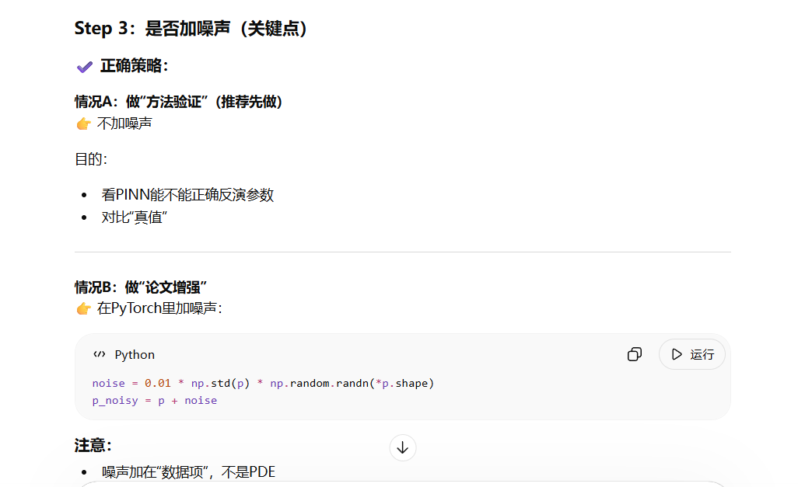

含各向异性的相场PINN建模

tensorboard --logdir=lightning_logs/

pinn-phasefield/
│
├── configs/                    # YAML配置（核心）
│   ├── default.yaml
│   ├── data.yaml
│   ├── model.yaml
│   ├── train.yaml
│   └── inverse.yaml
│
├── data/
│   ├── raw/                   # 原始.plt
│   ├── processed/             # npz数据
│   └── dataset.py             # 数据集类（PyTorch）
│
├── src/
│   ├── models/
│   │   ├── pinn.py            # PINN网络
│   │   └── components.py      # MLP等模块
│   │
│   ├── physics/
│   │   ├── pde.py             # PDE残差（核心）
│   │   └── parameters.py      # 可学习参数（γ等）
│   │
│   ├── losses/
│   │   └── loss_fn.py         # loss组合
│   │
│   ├── utils/
│   │   ├── convert.py         # plt → npz
│   │   ├── sampler.py         # 随机采样
│   │   └── normalization.py   # 归一化
│   │
│   ├── lightning/
│   │   ├── module.py          # LightningModule（核心）
│   │   └── datamodule.py      # LightningDataModule
│   │
│   └── train.py               # 训练入口
│
├── experiments/               # 输出（日志、模型）
│
├── requirements.txt
└── README.md

| C代码        | PINN          |
| ---------- | ------------- |
| difpx      | p_x           |
| difpxx     | p_xx          |
| ang        | atan2         |
| cos(4*ang) | torch.cos(4θ) |
| newp       | 不存在（直接拟合）     |
| 时间循环       | p_t           |

图中所述的“参数反演”确实是当前 PINN 领域极具价值的研究方向。尤其是在多物理场耦合的合金凝固模拟中，将未知的物理参数（如界面各向异性 γ、扩散系数 Ds 和 Dl、潜热 La 和 Lb）转化为可训练变量进行逆向求解，确实是很多高质量 SCI 论文的核心卖点。

然而，正如图片中所提示的，“很多 SCI 在做这个”。这意味着，仅仅完成基础的“参数反演”已经很难在顶刊（如 Acta Materialia 或 Computational Materials Science）上脱颖而出了。要想让你的文章真正具备“高水平”的竞争力，你需要增添以下几个核心维度的深度：

一、 突破 PINN 的固有瓶颈（解决模糊与收敛问题）
相场方程（Phase-Field）描述的合金界面非常陡峭，这属于典型的高频特征。普通的 MLP 网络在拟合这类 PDE 时存在严重的“谱偏差”（Spectral Bias），很容易学出边缘模糊、不够锐利的结果，同时还会面临数据损失（Data Loss）和 PDE 损失（PDE Loss）极难平衡的收敛困境。

引入特征映射 (Feature Mapping): 在网络输入层加入傅里叶特征 (Fourier Features) 或直接使用 SIREN 网络架构。这能专门强化模型对陡峭相界面的捕捉能力，解决预测图像模糊的问题，这是一个极佳的论文创新点。

自适应损失权重 (Adaptive Loss Weighting): 放弃手动调节 lambda_pde 和 lambda_data。在论文中引入 LRA (Learning Rate Annealing) 或 NTK (Neural Tangent Kernel) 等自适应权重算法，动态平衡各项损失，这能大幅提升你研究的算法深度。

二、 讲好物理故事：挑战传统数值算法的极限
不要仅仅把 PINN 当作一个花哨的拟合工具，要突出它能解决传统 C++ 求解器解决不了的痛点。

攻克极端过冷度下的数值不稳定性: 传统的有限差分 (FDM) 求解器在模拟极高过冷度或复杂物理环境时，极易因为网格条件 (CFL 条件) 的严苛限制而导致计算发散和崩溃。

外推与泛化能力: 你的论文可以强调一个强大的应用场景：利用 PINN 优秀的无网格特性，在低过冷度、易于观测的稳定数据下反演出准确的物理参数（如 γ），然后将这些训练好的网络和参数，直接泛化外推到传统 FDM 根本无法稳定求解的极端凝固条件下进行预测。

三、 多参数联合反演与敏感性分析
图中列出了多个待反演参数（γ, Ds, Dl, La, Lb）。如果你打算同时反演多个参数，这是一个典型的“病态问题”（Ill-posed problem）。

参数敏感性分析: 如果同时反演热力学参数、动力学参数和各向异性，系统很容易陷入局部最优。建议在论文中加入“参数敏感性分析”，量化不同参数对 PDE 残差的相对影响，并据此提出一种“分步反演”或“先验约束”的策略。

抗噪鲁棒性验证: 在你构建的数据集中人工加入不同水平的高斯噪声。如果在观测数据极度残缺且包含高强度噪音的情况下，你的模型依然能稳定且精准地反推出 γ 的真实值，这将是证明你模型鲁棒性的铁证。

接下来，为了最终实现高水平论文中要求的“精准参数反演”目标，你需要将重心从“写代码”转移到“训练策略与实验验证”上。建议你按照以下四个阶段逐步推进：

### 阶段一：初步试运行（Sanity Check）

在你投入大量算力之前，必须先验证刚才加入的所有模块是否能正常工作、梯度是否会爆炸。

1. **调整配置文件：** 打开你的 `configs/default_config.yaml`，确保在 `loss` 栏目下存在 `lambda_ic: 1.0` 和 `lambda_bc: 1.0`（可以先都设为 1.0）。同时，将 `debug: small_run: true` 开启，用少量数据跑几百个 Epoch。
2. **观察 Loss 走向：** 运行 `python src/train.py`。你需要重点监控 `loss_data`、`loss_pde`、`loss_ic` 和 `loss_bc` 是否都在稳步下降。如果加上了傅里叶映射后出现 `loss_data` 降不下去的情况，可以尝试把 `components.py` 里的 `scale=10.0` 调小（例如调到 `1.0` 或 `5.0`）。

### 阶段二：损失函数量级平衡（极为关键）

PINN 最常死在这一步。你的总 Loss 现在由四个部分组成，它们的物理量纲和梯度大小可能相差几个数量级。

- **现象：** 如果 `loss_pde` 的绝对值是 $10^4$，而 `loss_data` 是 $10^{-2}$，网络就会拼命去满足物理方程而完全无视你的真实数据（或者反过来）。
- **策略：** 跑完前几百步后，暂停程序，记录这四个 Loss 的数值。你需要通过手动调整 `default_config.yaml` 里的 `lambda_*` 权重，强行把这四个项乘到同一个数量级（例如都在 $0.1$ 到 $1.0$ 之间）。对于追求顶刊的工作，后期还可以考虑在代码中引入**动态权重自适应算法（如 NTK 或 ReLoBRaLo）**，这本身就是一个极好的发文亮点。

### 阶段三：两阶段反演训练法（Curriculum Learning）

直接让网络同时“从零学习复杂的相场演化”并“盲猜物理参数 $\gamma$”，极易陷入局部最优（例如网络干脆把 $\gamma$ 猜成 0，然后预测一片空白）。为了得到你 C++ 设定的真实值 `0.055`，推荐使用两阶段训练：

- **Step 1 (预训练代理模型):** 在 `default_config.yaml` 中先设置 `learn_gamma: false`，并将 `gamma` 固定为你猜测的一个初始值（比如 `0.01`）。先让网络专门拟合稀疏数据，把 $p$ 和 $c$ 的基本轮廓和急剧变化的界面学出来。
- **Step 2 (联合反演):** 等网络能够较好地复原图像后，保存模型权重。然后开启 `learn_gamma: true`，加载预训练模型继续训练。这时候，网络已经大致“懂”了物理场长什么样，优化器会非常专注地微调 $\gamma$，使其迅速收敛到 `0.055` 附近。

### 阶段四：论文配图准备

一旦成功反演，你需要为文章准备以下具有说服力的核心图表：

1. **参数收敛曲线：** 绘制 $\gamma$ 值随 Epoch 变化的曲线，展示它如何从初始猜想值（如 `0.01`）平滑过渡并稳定在真实值（`0.055`）。
2. **高保真度对比图：** 挑一个你**没有喂给网络训练**的时间步（比如 $t=80000$），将网络预测出的 $p$ 和 $c$ 渲染成二维彩色热力图，与你用 C++ 生成的原始 `.plt` 结果 并排对比，计算相对误差（L2 Error）。因为有了傅里叶特征映射，你的预测图应该极其锐利。
3. **稀疏数据鲁棒性分析：** 这是发顶刊的杀手锏。你可以展示：当只使用 10%、5% 甚至 1% 的网格数据时，传统方法完全失效，而你的 PINN 依然能准确反推出物理参数。

现在，你可以先去终端运行一次 `python src/train.py`，看看终端打印出来的 Loss 是否正常下降。遇到任何报错或异常的 Loss 曲线，随时发出来，我们一起 debug。

